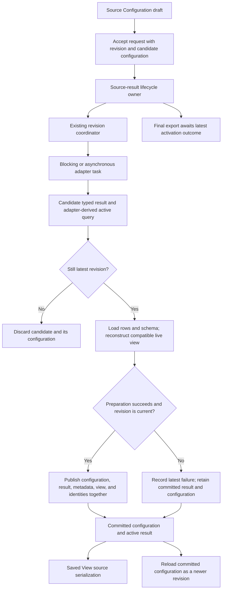

# Design

## Context

See [proposal.md](proposal.md#why) for the reproduced failure. The relevant current seams are `SourceAdapter` opening, typed `TableDefinition`/`TableStore`, `SourceResult`, and `SourceQueryCoordinator`. Keep those seams and the single Cargo package.

`App` currently changes `open_options` when `request_source_query` accepts a draft. `TableView` separately retains pending query and row identities, builds a candidate view on completion, and swaps itself with that candidate. Save combines `open_options` native text with active-result operations; reload opens `open_options`. Coordinator progress becomes idle as soon as a task returns a result, so a subsequent load or reconstruction failure is not necessarily visible to `await_latest_source_query`. Restoration currently ignores the boolean result of local view application, swallows some identity lookup errors, and falls back to old ordinals even when a source identity existed but no longer matches.

An active store already exposes its adapter-derived `SourceQuery`. Native adapters may remap its generation and operands during execution. Elasticsearch may also put a generated base into its runtime query; that does not mean the user supplied native text. These differences prohibit constructing committed configuration by copying either the draft query or all runtime native text indiscriminately.

## Goals / Non-Goals

**Goals:**

- Place requested-versus-committed reconciliation, candidate preparation, revision outcome, save authority, and reload authority behind one source-result lifecycle interface.
- Make activation a transaction over configuration, typed result, and compatible live view state without cloning a whole viewer as rollback state.
- Preserve source opening before view application and source-native operation semantics independently of bounded local `ViewTransform` behavior.
- Exercise observable behavior through the same lifecycle seam used by Source Configuration, reload, save, and final export.

**Non-Goals:**

- Implement the proposed `interface-updates` editor, change `u`/`q`/`v`/`s` controls, or add a new interactive workflow.
- Rediscover or reselect saved YAML during data reload, replace parser/composer implementations, change preview selection or profiling, or compute conditional colors.
- Add a universal query AST, plugin framework, new crate, generic configuration framework, global cache, or new YAML representation.
- Extend adapters' limit, identity, cancellation, or source-operation capabilities beyond their existing contracts.

## Decisions

### 1. One activation authority, with scheduling beneath it

Deepen source-result ownership at the existing `TableView` activation seam. The lifecycle owns committed source configuration, pending request context, latest accepted revision/outcome, coordinator lifetime, and the transition that publishes the active result with its compatible view. The coordinator remains the scheduler of real blocking and async adapter tasks, not the authority that declares a result activated. The committed record belongs to the active result; it is not another mutable application-wide `OpenOptions` cache.

The caller-facing surface consists of requesting a source replacement, progressing it, reading committed source configuration for save, reloading committed configuration, and waiting for the latest required activation for export. Exact Rust names and physical private-module placement can follow local conventions, but callers must not receive independent setters for committed configuration parts or reconstruct source configuration from multiple objects. Keep the lifecycle/coordinator alive across candidate publication; swapping a candidate view must not replace the scheduler with a fresh idle coordinator or erase a failed activation outcome.

**Alternative rejected:** merely delay `App.open_options` writes until a callback succeeds. It still requires callers to merge opening state, native selection, adapter-remapped operations, and failures in several paths, leaving reload and export with separate authority. Also reject a pass-through lifecycle wrapper that forwards the old split state unchanged.

### 2. Retain complete committed source configuration, not only a query

Build committed source configuration from validated opening choices plus successfully activated source input. Initialize it only after initial opening and view setup succeed. Retain format and delimited parse settings, JSON path, object interpretation and its resolution/origin as needed, schema-scan policy, selected relation or user-supplied native base query, and operational opening policies already carried by `OpenOptions`. Transient output preparation policies remain invocation-specific and must not accidentally redefine source query authority.

A request captures the committed opening settings plus draft changes without mutating the committed record. On successful activation, source filters and sort are derived from the candidate store's active query and candidate definition, not old `ColumnId`s. Resolve durable source keys once for committed source configuration so save and reload do not fabricate placeholder names. An unresolvable source operand is an activation error, not permission to write a wrong key. Native base text is the validated configured input, while the candidate's adapter query supplies effective generation, operands, and limit.

Keep generated selection explicitly distinguishable from user-native selection using existing relation/native option vocabulary. A generated Elasticsearch base in the adapter query remains generated when the configured selection was `table`; SQL/ES|QL logical and copyable provenance stay inspection artifacts. A successfully activated user-native edit removes the mutually exclusive selected `table`; a pending or rejected edit does not. This avoids replaying a composed limit or filter twice.

Preserve the effective limit semantics already supported by each adapter. File-source opening with omitted limit uses the existing unbounded sentinel internally and must reopen and serialize through the same omission behavior. Query-native sources retain their finite committed limit, including the adapter's finite default when the input omitted it. Do not introduce a new native unbounded mode or serialize the sentinel as an extreme positive YAML/SQL integer; no current query-native workflow produces that supported state.

**Alternative rejected:** derive everything from composed provenance or runtime `SourceQuery`. Neither contains all opening-only settings, and runtime generated native text is not the user's selection intent. Keeping the entire mutable `App.open_options` alongside committed source configuration is also rejected: after source opening transfers its configuration, App has no competing reload/save authority.

### 3. Candidate preparation must be fallible all the way to commit

Use the existing adapter task result as a candidate, not as proof of activation. Load its initial rows and schema, validate its adapter-derived active query, remap compatible presentation and local operation state, apply the local transform, and reconcile required stable identities against the candidate before publication. Report failures from each stage as the latest lifecycle failure. Store read errors during identity search differ from successfully proving a row absent: the former fail activation; the latter reset row-bound state.

Convert restoration paths used for activation/reload into a fallible preparation path. Do not call a method that silently restores a subset after transform failure and then report success. Expected missing/incompatible columns retain the existing warning/omission policy; they are not confused with execution errors. Carry pending late-schema settings and their session diagnostic state forward as view state, without implementing a second binder.

The prior active result remains owned and usable throughout preparation. The commit step moves candidate-owned result and prepared view state together only when its revision is still current. It does not copy the row store, render rows, or repeatedly serialize configuration on poll. Ordinary incremental sources remain incremental unless existing local operations or identity reconciliation require bounded traversal; activation is not a new unconditional full materialization pass.

**Alternative rejected:** commit source configuration after task completion, then rebuild the view in place. It partially advances authority on later row, schema, filter, or sort failure. Also reject whole-`TableView` cloning as transaction rollback: preserve the old active aggregate and construct a candidate instead.

### 4. Remap only compatible identity-backed state

For state attached to a source column, exact stable source identity is the first matching rule. Where a relational/native result's existing identity includes a result ordinal, use only a demonstrably unambiguous compatible durable source key within the same relation/result lineage to recognize a retained source column at a new position. Consult source names/canonical keys and source type compatibility, never rendered label overrides. Duplicate occurrence keys do not prove semantic continuity after ambiguous reordering; do not guess. Removed, renamed without proven retained identity, ambiguous, or incompatibly retyped columns lose/report their old identity-backed state according to existing policy.

Remove the blanket `or_else(old_index)` fallback for identity-backed columns. Preserve positional restoration only for existing genuinely identity-less legacy in-memory tables, where old behavior is explicitly positional; do not let that fallback cross into typed source-backed replacement or reload. Apply the same remap to local filters, sort keys, widths, labels, hidden columns, null policies, metadata, and cursor-column selection so a new field at an old ordinal never inherits unrelated settings.

Compatible replacements preserve cursor-following and marks only through adapter-proven stable identities within the appropriate relation lineage. File generation-scoped IDs never cross reload. SQLite rowid/primary-key and Elasticsearch document identity retain existing capability rules; arbitrary native aliases resembling keys prove nothing. A missing or filtered-out row, unavailable identity, or duplicate identity resets affected row-bound state. Reload opens a new generation and does not resurrect old row IDs by position; a clamped navigation position, where existing reload UX retains one, is not stable-row continuity.

**Alternative rejected:** migrate by ordinal or rendered name to preserve more settings. It attaches local operations and presentation to unrelated data, particularly after a native query changes projection.

### 5. Save and reload intentionally have different pending behavior from export

Saved-view generation reads committed source configuration immediately and current successfully applied local view state. It does not block on pending replacement or persist drafts. Existing atomic saved-file writing, secret redaction, and source/view section structure stay unchanged.

Reload first supersedes pending work, then reopens committed configuration as a newer lifecycle operation through the existing source adapter. It retains the selected relation instead of unexpectedly reopening an unresolved picker. Its candidate follows the same preparation/commit path. Both successful and failed reload invalidate older pending publication; failure leaves the prior committed aggregate intact and records the reload as the latest failure before propagating the error through the existing fatal interactive-reload route. This change does not add keep-running-on-reload-failure behavior. Stdin reload remains a no-op, including no invented reopening revision.

Final export instead awaits the latest required accepted revision and fails if that revision's execution, loading, reconstruction, or reload fails. The old visible table is valid for continued interaction and saving, not a silent fallback for failed final transformation. The lifecycle outcome must be durable independently of draining a one-shot TUI status message. A later accepted successful operation clears the earlier failure for export; a stale result cannot. Validation/capability rejection before acceptance does not create a required revision or revoke an already committed result.

**Alternative rejected:** block saving until pending work completes, reload pending text, or silently export the prior result. Those policies change existing interaction behavior or persist the demonstrated mismatch. Checking scheduler progress alone is rejected because task success does not imply activation success.

### 6. Preserve real worker ownership and latest-only publication

Keep asynchronous remote and blocking local work behind the existing task kinds. Revision supersession drops/cancels an async future where supported. Already running blocking work cannot be forcibly cancelled: retain its owned source resources, await its completion, discard stale outcomes, and execute the latest queued request under the current scheduling policy. Never add per-cell async work or a universal backend interface beyond the actual adapter seam.

The lifecycle checks revision identity at completion and immediately before publication. Reload advances that same authority rather than starting an independent reopen path that leaves the old coordinator capable of publishing. Shutdown closes publication and owns the worker/runtime until resources are released. Async shutdown may cancel supported work or await completion; blocking shutdown must not detach the blocking task or drop its runtime/source ownership prematurely. All terminal restoration and final-output ordering remains with existing orchestration.

**Alternative rejected:** replace/drop the active `TableView` and forget the coordinator, or detach blocking jobs on reload/quit to appear responsive. Both obscure lifetime correctness; UI responsiveness comes from adapter task scheduling, not abandoning work.

### 7. Replace caller reconciliation and test through the lifecycle seam

Remove eager mutation in Source Configuration Apply, independently assembled save source arguments, direct reopen authority in `App::reload`, and bool-only or duplicate activation paths that bypass the transaction. Migrate every current caller, including synchronous replacement helpers and tests, to the same successful-activation rules; retain useful parser/composer tests rather than rewriting them around private structs.

**Deletion test:** deleting the lifecycle would reintroduce draft-versus-committed merges, native/generated intent, adapter identity remapping, load/reconstruction outcomes, pending-save policy, reload supersession, and export failure handling in App, TableView, and serialization. Deleting the coordinator would reintroduce task scheduling, stale-result filtering, cancellation, and worker lifetime. Both earn their depth; the duplicated caller knowledge and eager options path should disappear, not survive behind wrappers.

## Dependencies and overlap

1. Dependency-safe application order is lifecycle → saved-view binding → conditional color → frozen preview, because frozen-preview preparation consumes the typed conditional-color evaluator. Architecture priority ranking remains lifecycle, binding, preview, color. This change can be implemented independently against existing binding and preview behavior.
2. Saved-view binding supplies one invocation's selected saved-view snapshot and CLI-overridden opening settings, then owns initial/delayed binding and once-per-session diagnostics. Lifecycle receives those source settings, owns their committed form, and restores live/pending view state on reload without rediscovering YAML or resetting warning delivery merely because of reload.
3. Frozen-preview preparation consumes an already configured active source result. Lifecycle does not select preview rows, change lookahead or remainder evidence, or modify the preview/output requirement blocks; its output delta adds only latest-activation failure authority.
4. Conditional-color deepening supplies typed computed styles. Lifecycle merely transports compatible column configuration during candidate restoration and does not resolve colors or serialize computed style strings.
5. `interface-updates` remains an editor proposal. This change must leave existing command paths intact and must not implement its editor tasks.

## Risks / Trade-offs

- [Generated runtime base text mistaken for user-native input] → Preserve original selection intent independently of adapter-generated provenance; cover both SQLite and Elasticsearch generated/native replay.
- [Candidate view restore silently loses errors] → Return explicit preparation outcomes and retain latest failure independently of scheduler idle state and TUI message consumption.
- [Native projections have incomplete lineage] → Prefer omission/warnings over inferred positional continuity; prove unambiguous compatible durable identity before migration.
- [Reload supersession with noncancellable blocking work] → Advance publication authority before reopen and retain worker lifetime until stale work completes; do not promise cancellation responsiveness beyond adapter capability.
- [Serialization omission changes a limit default] → Preserve supported unbounded file opening through omission and finite native bounds through their existing fields/defaults; do not add extreme-integer native unbounded serialization.
- [Broader source-backed remap changes interact with late binding] → Preserve pending view state and binding diagnostics; test observable rows and metadata after replacement/reload rather than private mapping implementation.

## Migration Plan

1. Add the consumer-visible regression and lifecycle failure/ordering coverage, then introduce committed configuration and candidate activation ownership while preserving adapters.
2. Cut Source Configuration, save, reload, and final preparation over together; delete obsolete split authority and unsafe identity-backed positional fallbacks. No saved-file migration or compatibility alias is required.
3. Run focused behavioral coverage and specific actual-binary smoke scenarios, then the repository's default/minimal/all-feature checks. Update existing relevant user docs and changelog after behavior is proved.
4. Rollback, if required before release, reverts the implementation cutover as one cohesive change; it does not ship mixed lifecycle paths. Existing YAML remains readable in either version, though the old version retains the known rejected-query saving defect.

## References

1. [Domain vocabulary](../../../../CONTEXT.md) and [proposal](proposal.md).
2. [Source application, save, and reload](../../../../src/lib.rs): `handle_source_config_key`, `handle_saved_view_key`, and `App::reload`; [view activation, restoration, and serialization](../../../../src/view/mod.rs): `request_source_query`, `poll_source_query`, `restore_view_settings_from`, and `to_saved_view_yaml`.
3. [Revision coordinator](../../../../src/table/query.rs), [typed result/store contract](../../../../src/table/mod.rs), and [opening settings](../../../../src/ingest/options.rs).
4. [Elasticsearch native-result design](../2026-09-06-add-elasticsearch-source/design.md), [SQLite design](../2026-07-26-add-turso-sqlite-support/design.md), [saved-view design](../2026-06-23-add-saved-views/design.md), and [interface-updates proposal](../../interface-updates/proposal.md).
5. [Source-model delta](specs/table-source-model/spec.md), [saved-view delta](specs/saved-views/spec.md), and [latest-export delta](specs/non-interactive-output/spec.md).
