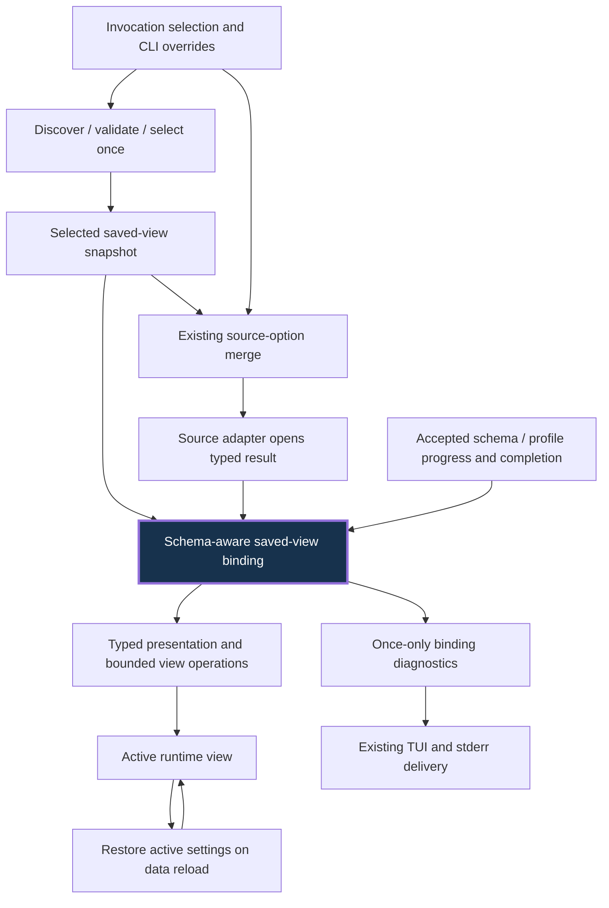

# Design

## Context

See [proposal.md](proposal.md) for motivation and [the saved-views delta](specs/saved-views/spec.md) for the behavior contract. The shared [domain vocabulary](../../../../CONTEXT.md) names the selected saved-view snapshot separately from committed source configuration.

`prepare_app` obtains source overrides through `selected_saved_view_source_options`, opens the source, and calls `apply_saved_view`, which independently discovers and selects again. Discovery recursively parses bundles and returns borrowed selection over candidate files. The second pass also constructs placeholder authoring state and warnings. Initial operation binding in `lib.rs` resolves references and converts sort/filter fields; `TableView::apply_pending_saved_operations` repeats those conversions after schema deltas. Initial application silently discards filter errors, delayed application retains them and can mislabel them as missing columns, and completion warnings share a single replaceable `source_status` slot. These are inspected paths, not claims that all edge cases have been reproduced.

The established architecture keeps typed `TableDefinition` separate from `TableStore`, source-native `SourceQuery` separate from bounded local `ViewTransform`, and source opening before view application. The archived preview design additionally requires pending settings without allowing lookahead to widen an emitted preview. The active `interface-updates` proposal is not permission to implement an editor.

## Goals / Non-Goals

**Goals:**

- Make startup know only selection, source-option merge/opening, and one bind entry point; place pending interpretation beside the same initial interpretation.
- Make schema progress and completion explicit inputs to binding, including completion with no added columns, while preserving real typed schema identities.
- Keep live view state mutable after initialization and preserve successful bindings instead of repeatedly reseeding it from YAML.
- Return binding outcomes and diagnostics for callers to apply or display without filesystem or terminal work inside the binder.

**Non-Goals:**

- Source-result scheduling/publication, committed source configuration, native-query composition, or source persistence ownership.
- Preview row selection/freezing, parser replacement, or conditional-color evaluation. Binding passes validated color metadata unchanged.
- New YAML fields, profile inheritance, a generic configuration framework, global cache, plugin system, new crate, or forwarding compatibility wrappers.
- Changes to filter predicates, raw/rendered matching, numeric availability/profiling, filename ranking, platform case rules, or normal authoring/write semantics.

## Decisions

### 1. Retain an owned selected saved-view snapshot for one invocation

Discovery and selection stay in `saved_views`. A focused invocation preparation entry point takes the existing selection policy, safe input identity, and config root. Its result distinguishes disabled support, enabled-without-selection, and a selected saved-view snapshot. It retains only the chosen validated document and relevant path/name/locale/authoring identity plus ordered discovery, selected-validation, and selection warnings; it does not retain all candidate YAML or introduce a process-wide cache.

The driver merges the snapshot's existing source overrides with CLI overrides through the existing `OpenOptions` precedence, validates them, opens the source, and passes the same snapshot into presentation binding. Disabled invocations return before discovery or placeholder authoring preparation. Enabled automatic selection with no match still permits the existing placeholder authoring behavior. Forced missing selection fails before source opening. Builds without `saved-views` compile out selection and binding and retain the default-source path.

Filesystem reads for explicit save comment preservation remain writing concerns; they must not replace selected settings. A subsequent fresh invocation discovers current files. Data reload does not call invocation selection: it restores live presentation, local operations, unresolved binding state, and diagnostic identities through existing source-identity reconciliation; the lifecycle change supplies the committed source configuration to reopen.

**Alternative rejected:** passing just a path or canonical name after opening still requires rereading/reselection and permits mixed snapshots. A global memoized discovery adds invalidation and lifetime policy without solving the invocation contract. Retaining the chosen typed value once is the smallest ownership change.

### 2. One schema-aware binding owner, with initial and progress entry points

Place the interpretation and per-invocation pending state in a focused internal saved-view binding module under `saved_views`, rather than making `lib.rs` or schema-delta handling parse saved semantics. The external seam needs only initialization from the selected snapshot plus saved-sort enablement, and advancement with current typed schema/completion and the existing presentation/filter preparation context. Both use the same private reference-resolution and operation-translation implementation.

The binding owner holds unresolved canonical metadata, saved ordered sort intent while some keys are unresolved, unresolved or temporarily unavailable filters, stable item identities, and emitted-diagnostic identities. The view keeps active presentation and `ViewTransform` as runtime truth. Binding produces typed updates and warning outcomes; callers install them through existing view operations. Application feedback distinguishes successful filter installation, temporary numeric-profile unavailability, and terminal invalidity, without introducing new parsing or comparison rules. Initialization and schema advancement share this feedback path rather than ignoring initial errors.

Do not copy whole `TableView` or row stores to implement binding. Borrow schema and necessary resolved metadata/profile facts. Retain only unresolved work and the ordered sort intent needed to preserve precedence; move validated settings where ownership allows. No eagerly allocated per-row configuration or complete-result copy is needed.

**Alternative rejected:** extracting two conversion loops into thin helpers while leaving pending decisions, retries, and warnings in callers moves lines but not knowledge. One binder with explicit progress earns leverage for startup, indexing, reload restoration, and preview preparation.

### 3. Resolve identities once per binding update; install metadata before operations

Preserve the existing source-kind distinction and valid compatibility matching. Delimited sources retain case-insensitive exact header matching, wildcard specificity/lexical metadata precedence, and existing first matching operation-column behavior. Structured operations resolve exact canonical keys first, then unique exact source display labels. Distinguish ambiguity from absence: an ambiguous structured reference stops with an ambiguity diagnostic and cannot fall through to permissive header matching; a genuinely absent noncanonical reference retains the existing case-insensitive/wildcard operation-header fallback. Metadata matching retains its existing canonical/unique-label rules. JSON pointers remain case-sensitive; relational occurrence keys and keyed-object identities stay supported. Canonical references remain valid when labels change.

Resolve column metadata against source identities before installing label overrides. Apply metadata, including explicit/inherited nulls and types, before resolving type-aware operation modes and parsing filters against the effective raw/rendered presentation. Structured operation label fallback uses the source definition's display labels, not newly overridden rendered labels; an override neither erases canonical identity nor becomes a new operation-reference alias. Reject ambiguous source labels before compatibility fallback. Retain all existing valid type aliases, mask/locale semantics, width/visibility behavior, color configuration, and raw-value preservation.

For provisional structured schemas, preserve the current late-capable canonical-reference policy, including unresolved JSON pointers, rather than deferring every arbitrary missing label or adding new strictness. A metadata update is applied only to newly resolved settings, not all snapshot settings on every delta. Saved filters install once when resolvable and usable. Schema completion finalizes absent references and invalid conditions, including completion without appended columns. A present numeric filter whose required profile has not yet been prepared stays pending until normal numeric-profile preparation supplies its definitive availability outcome; only then is it installed or finalized with an unavailable-operation warning. Completion of schema discovery alone must not discard that filter. Missing, ambiguous, invalid, and temporarily unavailable outcomes remain distinct.

The consumer reports profile availability explicitly through the existing column-inference/numeric-filter-reparse integration, not a new background profiler. In the TUI, schema completion followed by that normal inference step supplies the then-current profile as definitive, so a present but unusable filter is warned and retired without forcing a scan solely for binding. Complete/prefix output may finish its required whole-result numeric preparation after schema completion and supplies its definitive profile outcome then. Before the consumer's definitive feedback, temporary unavailability remains pending.

Ordered saved sort intent is retained until unresolved keys are settled, so a late high-priority key takes its original position instead of appending after lower-priority keys. Apply existing maximum-key and duplicate-key policy. Never reset unrelated live edits merely because indexing progressed: direct runtime edits to seeded operations take ownership of those fields and cancel superseded pending saved intent, while untouched pending intent can still resolve. `--sorted false` disables saved sort intent at initialization, so no immediate or delayed sort activates or forces completion; native source ordering remains unchanged.

**Alternative rejected:** resolving by rendered strings everywhere loses canonical identity and guesses ambiguous structured columns. Retaining every operation as an active retry also duplicates filters and overwrites live settings. Explicit pending outcomes preserve locality without changing filter semantics.

### 4. Binding warnings are queued outcomes, not source-query status

Keep `SavedViewWarning`-style field/reason identity and the existing `saved view: <field>: <message>` formatting route. Assign identities to configuration items (column key or ordered operation item) so multiple affected items on one column are retained, but the same item is not warned repeatedly as progress is polled. An ambiguity warning is not followed by a redundant missing warning for that item. Discovery/validation/selection warnings are captured once with the snapshot; initial and final schema binding emit consistent missing/invalid reasons.

Queue warnings separately from the single source-query status message. Drain startup and newly produced binding diagnostics into `App.diagnostics` using the existing warning formatting, retaining every item for once-only stderr emission. During interaction, update the existing `App.message` footer with the first newly queued warning and an additional-warning count when several arrive together, so late warnings remain visible before quit; this does not introduce a new diagnostics browser. For batch and interactive final export, preparation collects late warnings before the first stdout byte, then diagnostics are drained once. Do not force complete schema solely to issue a warning: an unfinished preview keeps absent canonical settings pending, and unread suffixes are neither validated nor diagnosed as definitively missing. Source and output errors remain normal failures, not non-fatal binding warnings.

**Alternative rejected:** reusing `source_status` overwrites warnings and couples configuration diagnostics to source replacement. Direct `eprintln!` inside binding cannot support terminal-free tests, TUI delivery, or errors-before-stdout sequencing.

### 5. Replace the old paths; preserve useful depth

Remove `selected_saved_view_source_options`' independent discovery and the discovery/selection and sort/filter translation inside `apply_saved_view`. Replace the separate `pending_saved_columns`, `pending_saved_sorts`, `pending_saved_filters` interpretation loops and completion message assembly with the new binding state/update path, adapting restoration and preview call sites to that state. Existing metadata setters, parsers, real filesystem discovery, source adapters, and atomic file-writing behavior remain useful implementations, not obsolete paths to delete.

**Deletion test:** deleting the new binder would scatter canonical-versus-label policy, type/null ordering, sort precedence, filter retry/installation, and once-only completion diagnostics back into startup, schema indexing, and preview. Deleting invocation snapshot ownership would restore duplicate recursive discovery and mixed-state risk. Conversely, if the cutover merely adds wrappers and leaves both old translation loops, it fails this design.

### 6. Cross-change seams and integration order

1. `own-source-result-lifecycle` owns requested/pending/committed source configuration, result activation, source reload, and serialization truth. This change supplies selected source overrides before opening; it never independently assembles committed configuration or changes source execution semantics.
2. `freeze-preview-projection` owns configured active result to frozen preview projection. It derives projection-local binding state from the same selected snapshot and interpretation. Observational schema/profile progress, including fields in rejected or lookahead rows, may resolve required filter dependencies; accepted emitted schema alone finalizes presentation. Speculative preparation must not consume live pending settings or once-only warning identities. Row selection, schema rollback, and remainder evidence stay preview-owned.
3. `deepen-conditional-color-evaluation` consumes validated column color metadata and owns computed typed styles and resolver behavior. Binding applies color metadata but neither resolves aliases nor computes profiles/styles.

The dependency-safe implementation order is lifecycle, binding, conditional color, then frozen preview: color can consume existing selected/full-result profile facts before preview cutover, and preview then consumes the typed conditional-color evaluator. Architecture-review priority remains lifecycle, binding, preview, color. Changes may be reviewed independently. Shared `lib.rs`/`view/mod.rs` edits are sequenced during application, not duplicated implementations or compatibility layers. Existing native-query composers and format parsers retain their tests.

## Risks / Trade-offs

- [Late filter and type dependencies] → Reuse current profile availability and filter parsing, test complete/provisional equivalence with actual rows, and distinguish unavailable operations from absent columns.
- [Sort intent overwrites interactive edits] → Retire pending saved intent for runtime-edited fields; test user changes between schema updates rather than replaying the snapshot globally.
- [Warning delivery after preparation] → Collect outcomes during preparation and drain before output; exercise both full exports and bounded preview without a counting/schema-completion pass.
- [Effective-label changes affect operation lookup] → Preserve canonical priority and unique fallback; cover ambiguous original and overridden labels, delimited matching, relational duplicate names, and keyed-object identities.
- [Snapshot lifetime grows unnecessarily] → Retain one chosen typed document and unresolved state, not discovery candidates or rows; no global cache or unrelated abstractions.
- [Cross-change shared files] → Integrate through the stated ownership sequence and rerun consumer-visible feature-matrix checks only after all applied changes settle.

## Migration Plan

1. Introduce owned invocation selection and the binding owner behind the existing `saved-views` feature, preserving parser, filesystem selection, and writing behavior.
2. Cut startup and schema-progress callers over together; migrate restoration and preview integration and remove duplicate interpretation paths in the same change.
3. Prove behavior through existing consumer seams and actual-binary smoke scenarios, then update applicable saved-view/output documentation and changelog. Do not repin private conversion loops or add tests of forwarding wrappers.
4. No saved YAML migration or schema version is required. Rollback is a code revert; user saved files are unchanged by invocation, binding, or preview flags.

## Verification Strategy

Test selection and binding through consumer-visible rows, metadata, diagnostics, and file effects: on-disk edit between selection and opening; initial/late equivalence; canonical versus ambiguous labels; provisional filters and numeric availability; sort/null/type precedence; once-only completion; overrides; disabled modes; live edits and reload. Preserve valid parser/composer tests. Runtime smoke must cover a recursive forced saved view, late-column preview with `--sorted false` retaining source ordering/filter/formatting, warnings on stderr with clean stdout, forced missing with empty stdout, and TUI reload after external YAML/live edits. Future validation uses the repository default/minimal/all-feature matrix and applicable source-feature checks. This planning phase runs no implementation checks.

## References

1. [Invocation/application code](../../../../src/lib.rs), [discovery/resolution code](../../../../src/saved_views/mod.rs), and [schema-delta/pending-operation code](../../../../src/view/mod.rs): inspected evidence summarized in Context.
2. [Saved-view requirements](../../../specs/saved-views/spec.md), including discovery, source options, pending columns, non-fatal failures, and non-interactive sorting suppression.
3. [Saved-view archived design](../2026-06-23-add-saved-views/design.md): validation, selection, runtime seeding, and atomic authoring.
4. [Fast-preview archived design](../2026-09-13-fast-table-preview/design.md): source/view ordering, pending settings, bounded lookahead, and error preparation.
5. [Interface-updates proposal](../../interface-updates/proposal.md): independent runtime view editor scope.
6. [Contributor guide](../../../../docs/contributing.md): one package, feature matrix, implementation verification, and documentation policy.
