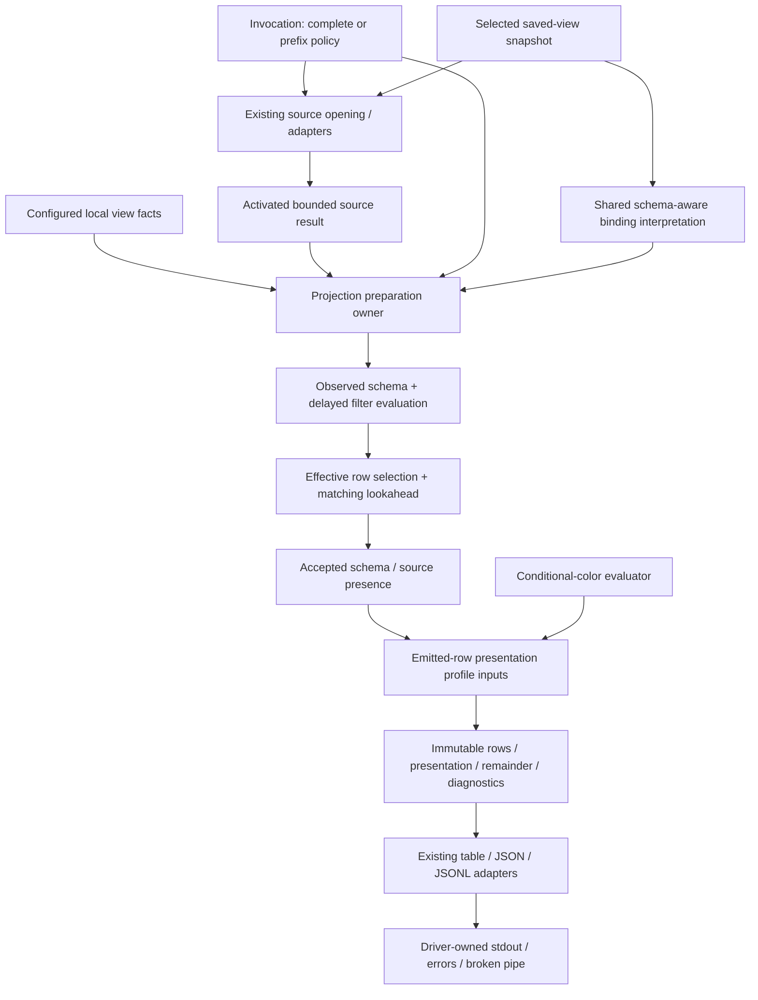

# Design

## Context

See [proposal.md](proposal.md) for motivation and [the delta](specs/non-interactive-output/spec.md) for behavior. Current `lib::prepare_app` selects a one-row preview viewport, toggles `defer_preview_preparation`, applies saved settings, and later invokes `TableView::prepare_preview`; the output writer then disables ordinary complete preparation. Inside selection, `TableView` is cloned/restored around prefix and rejected-schema checkpoints and finally stripped of its stores. Guards also affect query application, numeric filter acceptance, color metadata, and exact reductions [1–3]. Merely moving this method would preserve the coupling.

`TableDefinition`/`TableStore`, `PreviewSourceStore`, sequential delimited/JSON stores, `OutputAdapter`, and `PreparedOutput`/`PreparedRows` are existing seams [3–6]. JSON provides explicit field presence; delimited presence retains established initial header width. `RowCount` exactness, partial-result metadata, and source limits cannot be inferred from selected display strings. The archived fast-preview design deliberately permits whole-result local sorts and bounded eager native responses [7]. Use the [domain glossary](../../../CONTEXT.md), including committed source configuration, selected saved-view snapshot, and frozen preview projection.

## Goals / Non-Goals

**Goals:**

- One small preparation interface earns depth by hiding strategy choice, delayed evaluation, accepted schema, lookahead, row-count evidence, and presentation scope from driver and serializer.
- Separate observational schema used for interpretation from the schema eligible for output. Freeze emitted rows and presentation independently of mutable viewer state.
- Complete output and prefix output share the same configured-result seam without forcing complete ingestion on the streaming path or accidentally limiting JSON/JSONL/final interactive export.

**Non-Goals:**

- Source configuration activation/reload/persistence, filesystem saved-view discovery, conditional-color rule compilation, or query AST design.
- Parser consolidation, a generic store/plugin framework, extra crates, new YAML, changing CLI precedence, or constant-latency guarantees.
- Eliminating every legitimate viewer clone or complete-output helper: remove only obsolete preparation paths and their exclusive scaffolding; unrelated identity restoration remains outside this change.

## Decisions

### 1. Preparation owns configured result → immutable projection

Introduce a cohesive preparation module in the current package, adjacent to output rather than inside interactive rendering. Its public-to-the-package operation accepts an activated result read context, immutable configured view facts, one complete-or-prefix policy, and the output adapter's preparation requirements. It returns a frozen projection plus diagnostics and remainder evidence, or a preparation error. Exact Rust names are implementation-local; callers learn one request/result contract, not the streaming state machine.

The result read context retains the existing typed definition, store access, generation, extent, and partial-result facts. Advancing indexing through the existing store is allowed; mutating live view configuration, substituting/detaching live stores, truncating its rows, consuming live pending operations, or updating its viewport/screen state is not. Schema deltas encountered while reading are applied to projection-local schema and binding state. Direct preview has no live viewer; post-interactive complete preparation occurs after interaction ends. This change does not promise resuming a live viewer after output preparation or replaying store deltas already consumed by preparation. Do not clone a `TableView` to make this distinction.

The immutable result owns or safely retains its selected typed rows and stable presentation facts; it does not carry a source-fetch capability. Move selected owned row buffers into the result when possible, retain existing stable storage where safe, and capture only configuration/schema state needed for output. Avoid duplicating the complete viewer or full source merely to select a prefix. Keep the existing `PreparedOutput`/`PreparedRows` output seam, but make row iteration a read of frozen data instead of a callback into `TableView`. A consuming adapter can render display values from immutable frozen facts, but cannot initiate parsing, binding, selection, or source profiling. Table layout/control escaping remain in the adapter; structured adapters retain unnormalized display strings.

**Alternative rejected:** an extracted wrapper around `TableView::prepare_preview` still needing `preview_preparing`, clones, and detachment. It relocates implementation without reducing interface obligations. Separate table-only and complete-output state machines are also rejected: they would duplicate binding/formatting semantics and keep writer access to the live viewer.

### 2. Source opening policy is explicit; settings are declarative

Resolve invocation and adapter capability errors before input, pass preview policy to source opening before ingestion, and retain source-before-view ordering. Direct previews use the opened active result plus configured view facts; they need not construct a special one-row viewport just to avoid loading. Interactive use still constructs `TableView`. Batch setup may reuse application context where useful, but settings must not execute output traversal as a hidden effect or require a defer-before-settings call.

Saved-view binding produces interpreted configuration with pending schema-aware operations, not an instruction to mutate an interactive viewer before preparation. Preparation uses the same binder interpretation with its own narrow state. Initial and delayed settings do not trigger source-wide query/color refresh from presentation setters. Required latest-source-result waiting/activation happens through the lifecycle owner before preparation; this module does not decide whether pending or rejected source configuration is committed.

**Alternative rejected:** keeping the temporary flag and adding more guards for new setters. It requires callers to know a temporal precondition and makes every viewer feature participate in preview semantics.

### 3. Choose traversal by semantic need, not apparent initial schema completeness

Complete mode resolves all effective rows within the active source result. It retains source operations → local filtering → enabled local sorting ordering and existing raw-versus-rendered numeric/filter semantics, formats, visibility/order, null placement, and late saved configuration. It does not cross the source limit or use viewport/start position. JSON/JSONL and post-interactive exports always use complete mode.

Prefix mode chooses an internal strategy:

| Need | Required preparation |
| --- | --- |
| No enabled local sort or active/pending numeric view filter, default schema scan | Sequential matching selection to N plus one matching lookahead, or effective EOF; bounded parser read-ahead |
| Pending nonnumeric saved filters | Observe schema, retain deferred row range, bind through existing interpreter, re-evaluate preceding rows once required binding resolves; preserve source order |
| Enabled local sort, including a pending saved sort not suppressed by `--sorted false` | Complete the active result and required sorting schema/profile, filter and exact-sort it, then select N |
| Any active or pending numeric view filter | Preserve the existing conservative rule: complete active-result profiling before numeric filter interpretation, then select N; do not infer that prefix-only evidence is sufficient |
| Explicit/saved `schema_scan: full` | Complete required active-result schema traversal and accepted-row presence, even when initial columns look complete; emit only N |
| Native bounded eager response | Await successful bounded response; local prefix preparation never expands source bounds or issues refill/count queries |

Full traversal for sort/filter interpretation does not license omitted rows to affect default preview presentation. Full-schema mode intentionally expands eligible schema using all accepted rows, not width or automatic color profile scope. A schema-complete native result still may need local row selection; conversely, all known columns bound does not prove a requested full file scan finished. Existing `PreviewSourceStore` continues owning file source filters, source limits, delayed source-column validation, and their schema exposure. Do not push N into `SourceQuery` before local operations, merge `SourceQuery` and `ViewTransform`, or sort an input prefix and label it exact top-N.

**Alternative rejected:** use `row_count`/all-column-known checks as a universal fast path. They cannot prove filter completion, full-schema acceptance, or whole-result numeric interpretation.

### 4. Two schema tracks replace broad checkpoints

Maintain projection-local observational definition and binding progress separately from accepted output schema/presence/type evidence. Observed deltas permit required delayed filters to become evaluable even if the revealing row is later rejected. They do not automatically commit new columns or numeric widening to output. Accepted schema is accumulated from eligible emitted rows under default scanning; required bounded format detection and established source headers remain honored. Retain source-to-projection column identities/mapping so excluding a rejected-only column does not shift filter/configuration targets.

While filters remain unresolved, retain deferred row indices/IDs and access their existing stored typed rows; do not repeatedly clone the viewer or duplicate deferred cell vectors. Once binding resolves, replay rows in source order, accepting no more than N emitted rows and tracking the next match separately. At schema completion, apply the binder's existing missing-column policy; missing saved view filters do not discard rows, whereas unresolved source filter requests retain their existing validation errors. Binder interpretation and warning identity rules are not duplicated here.

Once N rows are selected, further observation is strictly remainder evidence (unless full scan or interpretation needs more). Lookahead cannot alter frozen emitted presentation or consume live binder pending operations/warnings. Rejected rows likewise cannot commit output fields. With full scan, accumulate presence from **all** accepted source/view-filtered rows, including accepted rows beyond N, while excluding rejected-only fields. For structured sources, use explicit `present_columns(RowId)` evidence: explicit null/empty is present, null padding is not. For nonempty delimited results, established initial header columns remain source-defined presence even when a record is short. Preserve the current empty-result exception: when a local view filter rejects all rows and no source filter is active, suppress all output columns for both structured and delimited sources. Empty source-filtered delimited results retain established headers under the existing header policy; a source filter remains authoritative for this distinction even when local filters also exist.

**Alternative rejected:** one schema checkpoint per row or deriving presence from nonempty display values. The former retains broad copying; the latter loses explicit null/empty fields and confuses structured absence with delimited header presence.

### 5. Remainder and presentation are frozen evidence, not a counting invitation

Track emitted count, whether another effective match was observed, whether effective EOF was proved, any exact effective total already available, and partial-result extent. No omitted match means no summary. An exact effective total permits numeric remainder; an unfiltered count with active local filters does not. A partial native result retains unknown remainder when omitted rows exist, even if the locally returned response length is known. One confirmed extra match with unknown total produces `more rows...`; no counting pass, physical-newline estimate, or extra native query is added. Full traversal done for another required semantic reason may produce an exact effective count.

After selection freezes, resolve configured visible columns, labels/order, formats, header policy, alignment, explicit width overrides, and automatic-width inputs using emitted rows and their eligible header. Supply emitted-row-only numeric/profile inputs to the conditional-color module for automatic gradients; fixed rules keep their existing meaning. Complete output profiles its complete effective projection. Numeric evidence needed for **filter interpretation** is a separate input from emitted-row **color profile** scope. `auto`/`never` color does not invoke color profiling. This change does not own rule/alias resolution or computed-style representation; it uses the sibling color evaluator instead of decoding computed color strings in a new path.

**Alternative rejected:** reuse a full-result reduction because the source was already traversed for sorting. Width/gradient behavior would change even though correct row ordering was preserved.

### 6. Errors, diagnostics, and source lifetime are part of the interface

Complete every required prefix/lookahead decode, source/native query, delayed binding, traversal, profile, and capability check before the writer receives a projection. Collect relevant late diagnostics using the binder's existing once-only warning policy, and drain them to stderr before output. On error publish no projection; retain the existing stderr/nonzero contract. The writer owns only serialization failures; `BrokenPipe` stays a clean exit and other write failures may leave partial bytes.

Default streaming preview does not validate unread JSON/CSV/NDJSON suffixes. Nested-pointer seeking, bounded shape/delimiter/encoding detection, selective filters, and required lookahead can consume more input legitimately. Keep the existing format-specific rules rather than pretending byte buffers and logical records are interchangeable. Exactly N rows on live stdin without another match/EOF are insufficient remainder evidence. Once required evidence is available, release the direct input lifetime/handle and finish while the producer remains open; do not start a background drain or wait for producer EOF. This lifetime action belongs to the direct invocation's source owner, not mutation of a live viewer's store attachment.

## Depth and deletion test

Deleting this preparation module would redistribute strategy selection, deferred-row replay, accepted/observed schema isolation, source-presence policy, remainder certainty, selected-row profile scope, and freeze/error ordering into startup, `TableView`, and writers. That is meaningful depth and leverage across all output consumers. Acceptance is therefore not “a new function/module exists”: callers must no longer toggle preview lifecycle or strip stores, output row access must not fetch source data, and the cloned live viewer must not be the selection workspace.

Preserve useful modules whose removal would spread real behavior: `PreviewSourceStore`, sequential format adapters, source-query coordinator, binder, and output serializers. Delete obsolete `prepare_preview`/defer entry points, `preview_preparing` and its guards, viewer clone/restore preview checkpoints, detachment-based freeze, mutable-view-backed prepared row access, and complete-output paths made dead by the cutover. Do not keep forwarding aliases or two competing preparation paths. Pure parser/composer tests stay because they prove real format/query semantics; replace tests tied to removed viewer internals with preparation-interface behavior tests.

## Cross-change dependencies and overlaps

1. **Source-result lifecycle:** owns committed source configuration, requested/pending revision waiting, atomic activation, reload, and persistence. Preparation receives its successfully activated source result. Shared files may include `lib.rs` and `view/mod.rs`, but no source configuration persistence rule is introduced here. The sibling's added latest-export activation requirement remains authoritative.
2. **Saved-view binding:** owns one selected saved-view snapshot and canonical initial/delayed interpretation, precedence, missing-column policy, and warning identities. Preparation derives narrow local binding state from that contract; observational schema can resolve filters, while accepted schema alone defines presentation. Spec deltas here modify non-interactive-output ownership/preview requirements, not saved-views binding requirements.
3. **Conditional color:** owns typed styles and rule/alias evaluation for UI/output. Preparation defines which rows provide profile inputs and the lifetime of frozen results; it neither duplicates evaluation nor repins incidental cache representation.
4. **Integration order:** lifecycle → binding → conditional color → frozen preview, with interface alignment at each step. Color evaluation first accepts existing complete/emitted profile facts; frozen preparation then consumes that typed evaluator. Plan each independently; implementation removes older paths rather than installing wrappers. No active editor/interface proposal is treated as shipped behavior.

## Risks / Trade-offs

- **Restrictive filters, nested seeking, sorting, numeric profiles, and full scans remain expensive** → State semantic traversal needs explicitly and test results/bounds rather than fixed elapsed-time claims.
- **Store indexing advances shared read caches even without viewer mutation** → Restrict mutation to existing source-read behavior, apply schema/binding only locally, and verify final post-interactive configuration/store attachments are not truncated or detached; resuming interaction and replaying consumed deltas are not promised.
- **Schema presence and delayed binding can be conflated** → Keep observational and accepted tracks explicit; cover null/empty presence, rejected-only fields, missing filters, full scan, and deferred replay through consumer-visible projections.
- **Freezing complete output could duplicate every row or presentation string** → Move owned buffers or retain immutable storage; avoid full-view copies and per-row schema snapshots; cache only facts required by the existing adapters.
- **Lookahead could consume binder warnings or use full-result color evidence** → Use local binding/diagnostic state and emitted-row-only color inputs; exercise repeated reads and changed live settings against frozen bytes.
- **Early stdin exit can close the producer's pipe** → Preserve documented preview semantics; smoke-test a real producer kept open, not only an in-memory reader.

## Migration Plan

Implement within one package with no CLI/YAML migration. Establish the complete/prefix preparation contract and consumer-visible tests, migrate both direct and final interactive output to it, then remove the old viewer-mode and writer-completion paths in the same cutover. Retain actual parser/store/output adapters and valid format/composer tests. No compatibility shim is necessary. Rollback is a whole change revert if behavioral proof fails, not a runtime switch between old/new selection.

After implementation, run focused interface and integration tests, the repository feature matrix, and real-binary throwaway smoke cases before updating applicable guides/changelog. Smoke fixtures/processes live outside committed source/docs; record only checks actually exercised. Planning itself runs only OpenSpec status/instructions and authors these artifacts.

## References

1. [Current non-interactive output contract](../../specs/non-interactive-output/spec.md), modular output and table preview preparation requirements.
2. [Startup and output orchestration](../../../src/lib.rs), `run` and `prepare_app`.
3. [Current viewer preparation and guards](../../../src/view/mod.rs), `prepare_preview`, query application, numeric filters, and color reductions.
4. [Output seams](../../../src/output.rs), `PreparedOutput`, `PreparedRows`, and output writers.
5. [Store interface](../../../src/table/mod.rs) and [source-filtered preview store](../../../src/table/preview.rs).
6. [Sequential delimited preview](../../../src/ingest/delimited/preview.rs) and [sequential JSON preview](../../../src/ingest/json/preview.rs).
7. [Archived fast-preview design](../archive/2026-09-13-fast-table-preview/design.md).
8. [Consumer-visible preview regressions](../../../tests/non_interactive.rs) and [contributor guide](../../../docs/contributing.md).
